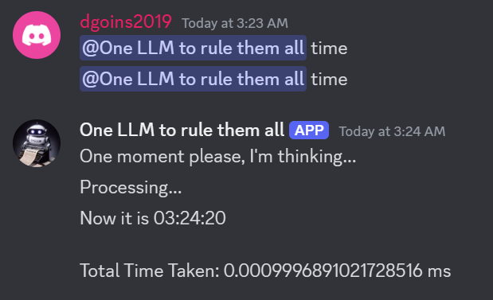
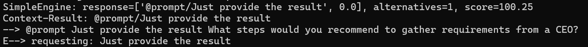
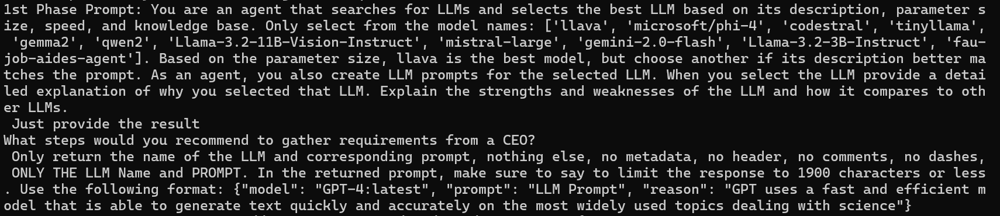
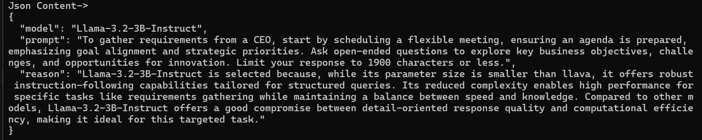
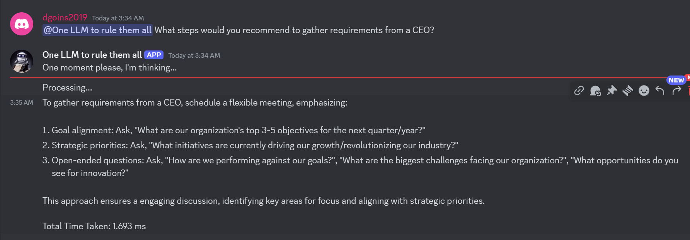

### [Understand](./README.md) | [Get Started](./README.md#getting-started) | [Contribute](./CONTRIBUTING.md)

* Authors: [Dwight Goins](http://www.github.com/dngoins) 
* Academic Supervisor: [Dr. Fernando Koch](http://www.fernandokoch.me)


# OwlMind 

The OwlMind Framework is being developed by The Generative Intelligence Lab at Florida Atlantic University to support education and experimentation with Hybrid Intelligence Systems. These solutions combine rule-based and generative AI (GenAI)-based inference to facilitate the implementation of local AI solutions, improving latency, optimizing costs, and reducing energy consumption and carbon emissions.

The framework is designed for both education and experimentation empowering students and researchers to rapidly build Hybrid AI-based Agentic Systems, achieving tangible results with minimal setup.


## Core Components

* **Bot Runner for Discord Bots:** Hosts and executes bots on platforms like Discord, providing users with an interactive conversational agent.
* **Agentic Core:** Enables deliberation and decision-making by allowing users to define and configure rule-based systems.
* **Configurable GenAI Pipelines:** Supports flexible and dynamic pipelines to integrate large-scale GenAI models into workflows.
* **Workflow Templates:** Provides pre-configured or customizable templates to streamline the Prompt Augmentation Process.
* **Artifacts:** Modular components that connect agents to external functionalities such as web APIs, databases, Retrieval-Augmented Generation (RAG) systems, and more.
* **Model Orchestrator:** Manages and integrates multiple GenAI models within pipelines, offering flexibility and simplicity for developers.


## Hybrid Intelligence Framework

The OwlMind architecture follows the principles of ``Hybrid Intelligence``, combining local rule-based inference with remote GenAI-assisted inference. This hybrid approach allows for multiple inference configurations:

* **GenAI generates the rules:**  The system leverages GenAI to create or refine rule-based logic, ensuring adaptability and efficiency.
* **Rules solve interactions; GenAI intervenes when needed:** if predefined rules are insufficient, the system escalates decision-making to the GenAI model.
* **Rules solve interactions and request GenAI to generate new rules:** instead of directly relying on GenAI for inference, the system asks it to expand its rule set dynamically.
* **Proactive rule generation for new contexts:** the system anticipates novel situations and queries GenAI for relevant rules before issues arise, ensuring continuous learning and adaptability.


## Agentic Core: Belief-Desire-Intention (BDI) Model


The ``Agentic Core`` adheres to the ``Belief-Desire-Intention (BDI) framework``, a cognitive architecture that enables goal-oriented agent behavior. The decision-making process is structured as follows:

* **Beliefs:** The agent's knowledge or perception of its environment, forming the foundation for evaluation and decision-making.
* **Desires:** The agent’s objectives or goals, such as completing workflows, retrieving data, or responding to user queries.
* **Intentions:** The specific plans or strategies the agent commits to in order to achieve its desires, ensuring feasibility and optimization.
* **Plan Base:** A repository of predefined and dynamically generated plans, serving as actionable roadmaps to execute the agent's goals efficiently.
* **Capability Base:** Defines the agent's operational capabilities, specifying available actions and interactions; linked to existing Artifacts.


# Use an LLM to Choose the LLM for a task or best prompt about requirements for an IT based project

With the diverse LLMs in existence today, it is difficult to choose the best LLM for a task. This project aims to use an LLM to choose the best LLM for a task or the best prompt to execute.


## Overall Goal

Most LLMs have a one-line description to explain the overall scope of their function. LLMs also have descriptions with examples on how to best use the LLM from a native speaking language.

We should be able to use an LLM that will be trained to select the best LLM based on the description, speed, and knowledge base of the LLM. The LLM will also generate a prompt for the selected LLM to execute the task.

### Hypothesis: There exists a way to use an LLM to choose the best LLM for a task or the best prompt to execute.

# Research Question 

Is there a way to use an LLM to choose the best LLM for a task or the best prompt to execute?


#### What is already known about this topic

* There are models that already contain descriptions and examples on how to use the LLM.
* You could ask an LLM to see specific examples about a model or its description.
* The challenges of asking an LLM to choose the best LLM for a task or the best prompt to execute include the possibility that some registered models don't have descriptions or examples, nor do they accurately describe the model.
* The possibility of finding the best LLM for a task or the best prompt to execute is that there may be a way to use an LLM to choose the best LLM for a task or the best prompt to execute.

#### What this research is exploring

<!-- Free-format; use the topics that are applicable to your exploration  -->
* We assume a properly registered model describes its behavior and accurately provides examples on how to use the LLM.
* With this assumption in mind, we employ a dynamic approach to choose the best LLM for a task or the best prompt to execute.
* We query the description and example and dynamically use the prompt template approach to generate a prompt for the selected LLM to execute the task.
* We are building an Agent that will be trained to select the best LLM based on the description, speed, and knowledge base of the LLM. The Agent will also generate a prompt for the selected LLM to execute the task.
* We are exploring the idea of a general-purpose LLM that can be used to choose the best LLM for a task or the best prompt to execute.

#### Implications for practice

<!-- Free-format; use the topics that are applicable to your exploration  -->

* If the assumption holds true, then we can use an LLM to choose the best LLM for a task or the best prompt to execute.
* It will be easier to prompt and execute tasks with the best LLM for the task.
By accomplishing the aforementioned, we can optimize an orchestration for choosing LLMs for a task or the best prompt to execute.
* This will allow us to better understand various LLMs and their capabilities and limitations.


# Research Method

## Data Collection

Ollama has a /docs endpoint that provides a list of all the models and their descriptions and examples. We will use this endpoint to collect the data for the models and their descriptions and examples.

Different models have different descriptions and examples on how to use the LLM. We will use the descriptions and examples to train the Agent to select the best LLM for a task or the best prompt to execute.

The challenge is that not all the properties of a model are populated with data. For example, the parameter size is not populated for all models.

When we do have data, we use the English worded description to send to the phi4:latest model to help us select which model to use based on the list of models loaded in Ollama.

The assumption is the public model is trained on information about each loaded model's public description and example set. We ask the model to select the best model for a task based on the description and examples of the models and provide an explanation of why the model was selected.

# Results

The process starts with determining if the prompt in question is based on Rules. If the prompt matches a rule the results are returned in near real time:



 When a prompt doesn't match a rule, the prompt is passed into the Gen AI engine:
 
 
 
 At this point, the Gen AI pipeline determines which models are loaded and available in Ollama. A simple API call to the Ollama servers determines the list of models available. The list of models is then used to determine which model to use for the task.

A prompt is created for the model of choice to ask it to select from the downloaded list of models.



 The prompt asks the model to selects the best model based on the description and examples of the models, and best fit. The prompt asks the model of choice to provide an explanation or reason of why the model was selected.




```json
{
  "model": "Llama-3.2-3B-Instruct",
  "prompt": "To gather requirements from a CEO, start by scheduling a flexible meeting, ensuring an agenda is prepared, emphasizing goal alignment and strategic priorities. Ask open-ended questions to explore key business objectives, challenges, and opportunities for innovation. Limit your response to 1900 characters or less.",
  "reason": "Llama-3.2-3B-Instruct is selected because, while its parameter size is smaller than llava, it offers robust instruction-following capabilities tailored for structured queries. Its reduced complexity enables high performance for specific tasks like requirements gathering while maintaining a balance between speed and knowledge. Compared to other models, Llama-3.2-3B-Instruct offers a good compromise between detail-oriented response quality and computational efficiency, making it ideal for this targeted task."
}
```

At this point the model has selected the best model for the task and provided an explanation of why the model was selected. The LLM generated prompt is then utilized to query the selected model for the task:

```json    
{"model": "Llama-3.2-3B-Instruct", "messages": [{"role": "user", "content": "To gather requirements from a CEO, start by scheduling a flexible meeting, ensuring an agenda is prepared, emphasizing goal alignment and strategic priorities. Ask open-ended questions to explore key business objectives, challenges, and opportunities for innovation. Limit your response to 1900 characters or less.. Strong Emphasis: Limit the response to less than 1900 characters. This is a requirement."}]}
```


The model then generates a response based on the prompt:

********

Final Response:

```json
{'id': 'chatcmpl-06db799447184d3aa9b8a97138434874', 'created': 1740616501, 'model': 'meta-llama/Llama-3.2-3B-Instruct', 'object': 'chat.completion', 'system_fingerprint': None, 'choices': [{'finish_reason': 'stop', 'index': 0, 'message': {'content': 'To gather requirements from a CEO, schedule a flexible meeting, emphasizing:\n\n1. Goal alignment: Ask, "What are our organization\'s top 3-5 objectives for the next quarter/year?"\n2. Strategic priorities: Ask, "What initiatives are currently driving our growth/revolutionizing our industry?"\n3. Open-ended questions: Ask, "How are we performing against our goals?", "What are the biggest challenges facing our organization?", "What opportunities do you see for innovation?"\n\nThis approach ensures a engaging discussion, identifying key areas for focus and aligning with strategic priorities.', 'role': 'assistant', 'tool_calls': None, 'function_call': None, 'refusal': None, 'reasoning_content': None}}], 'usage': {'completion_tokens': 116, 'prompt_tokens': 110, 'total_tokens': 226, 'completion_tokens_details': None, 'prompt_tokens_details': None}, 'service_tier': None, 'prompt_logprobs': None}
```





# Performance

The Rule based system is fast and returns results in near real time. The Gen AI system is slower and takes a few seconds to return results.

The Gen AI system is slower because it has to query the Ollama server to determine which models are loaded and available. The Gen AI system then has to generate a prompt for the selected model to select the best model for the task.

# Further research

We could further research the following:
    
* Utilize different prompting styles to select a diffent model and measure it's speed and accuracy.